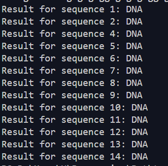
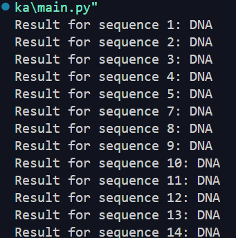
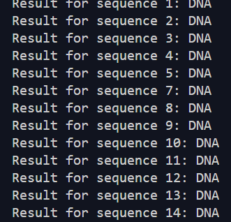

# Hyden Mark Model

Ukolem bylo implementovat skytý Markovův model pro hledání genů a aplikovat jej na da data E.coli

## 1. úkol

Prvním úkolem bylo naprogramovat hmm nebo využít nějakou knihovnu hmm.  
Já jsem se rozhodl využít knihovnu hmmlearn která je v komunytě velice oblíbená a široce využívaná.
Práce s ní byla dobrá až na to že poté co jsem si zjistil jaká funkce by se hodila pro moje konkrétní použítí tak mi to neustále vyhazovalo error že to je zastaralé a že tato funkce dostala zásádní změny. To jsem se nebyl moc schopný ani pomocí dokumentace příliš zorientovat naštěstí jsme se pak dočetl na jednom fóru že název funkce byl změněn a poté se zase pracovalo dobře.

## 2. úkol

Jako druhé bylo nutné naučit hmm. To jsem si myslel že bude jednoduchý úkol ovšem velkou práci mi dalo pochopit proč je tam tolik čísel a co k čemu je. (Původně jsem si myslel že ty první dvě jsou zbytečná pak jsem si uvědomil že je budu používat jako trénovací pro to co není DNA). Dalším problémem bylo načíst čísla a správně je použít použití nebylo problém a po krátkém přemýšlení jsem přišel i na metodu jak data dobře načíst [nacitani_trenovacich_dat.py](nacitani_trenovacich_dat.py). Poté už nebylo problém nasázet data do [hmm](main.py)

## 3. úkol

Tento úkol dost zmatený jelikož jsem nepochopil proč se nám dává tolik čísel ale po uvážení jsem se rozhodl využít v hranatých závorkách a nasázel jsem je do hmm a tady jsou výsledky

  

Ale testoval jsem to na 6 komponentách a 200 iteracíh tudíž si myslím že to je přesné.

## Můj postup

Nejdříve jsem si sestrojil funkční hmm s testovacími daty. Tyto data jsou zakomentována v kódu.

Poté jsem se snažil rozsekat sekvence do pole pro zadávání do modelu to jsem udělal tak že jsem si první rozsekal text a následně jsem se teprve snažil zjisti kde ho mám využít. Stejně jsem postupuval i u testovacích dat.

Poslední krok už bylo jenom načíst data do hmm to bylo už bez problémů pouze jsem importoval to co jsem potřeboval

Můj postup tedy postupně bylo postupovat od všeobecného ke konktrétnímu
